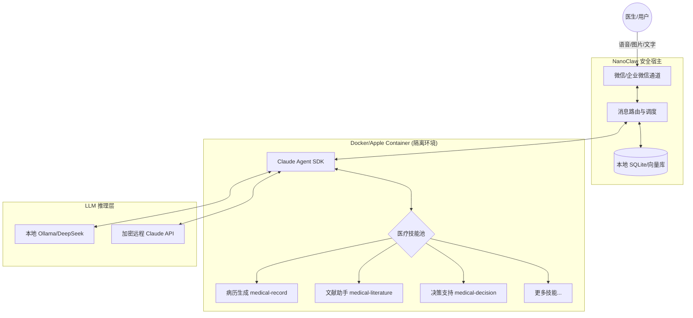
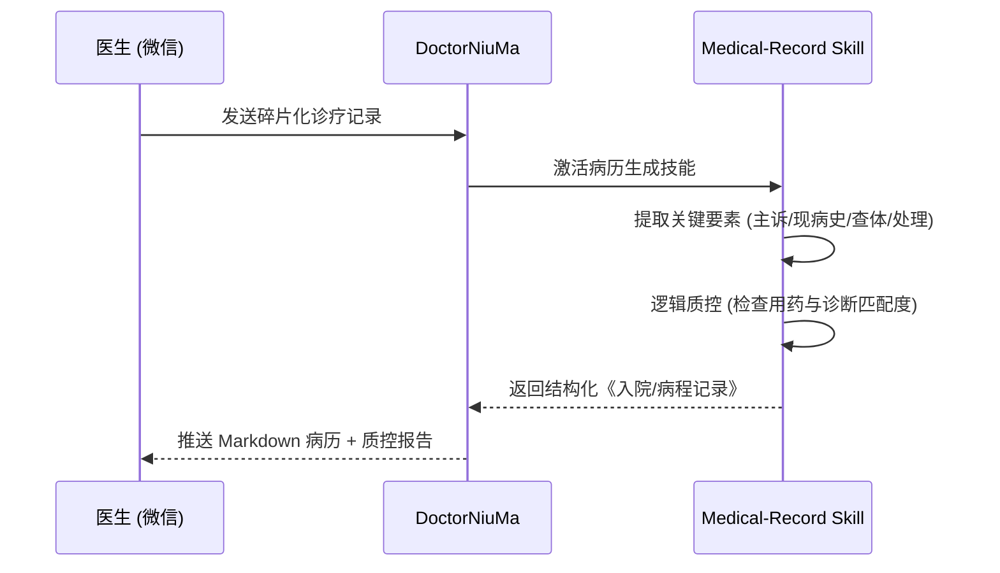

# 🩺 DoctorNiuMa (医生的数字牛马)

> **专为中国医生打造的“第二大脑”：基于 NanoClaw 的企业级 AI 医疗助手套件。**

**DoctorNiuMa** 是一款运行在安全隔离容器中的 AI 助手。它不仅是一个聊天机器人，更是一个具备 10 项核心医疗技能的**临床与科研秘书**。它通过微信接收指令，调用本地 LLM 和医学知识库，帮助医生从繁重的文书、行政、学术任务中彻底解放。

---

## 🏗️ 系统架构

DoctorNiuMa 采用**高隐私隔离架构**，确保所有 PHI (受保护健康信息) 仅在本地容器内处理。



---

## 💡 典型使用用例 (Use Cases)

### 1. 临床场景：从碎片化信息到标准病历
**场景**：医生在查房时通过微信发送一段语音转文字：“3床刘大爷，75岁，心衰老病号，昨晚突发喘憋，不能平卧，查体双肺底湿啰音，BNP 3000，我给开了速尿 20mg 静推。”

**Agent 工作流**：


### 2. 学术场景：最新指南 RAG 问答
**问句**：*“帮我看看 2024 年心衰指南对于 ARNI 的使用剂量有什么新调整？”*
- **能力**：激活 `medical-literature` 技能，检索本地向量库中的最新指南片段。
- **输出**：直接给出证据等级、起始剂量及调整建议，并附带引用来源。

### 3. 行政场景：SBAR 交班报告自动整理
**场景**：医生下班前将一天的零碎任务记录发送给助手。
- **输入**：*“交班：3床平稳，8床明天手术要看下凝血，12床下午有点发烧，已经物理降温了。”*
- **输出**：自动格式化为标准的 **SBAR (现状-背景-评估-建议)** 报告，可直接粘贴至交班系统。

---

## 🛠️ 10 项核心医疗技能清单

| 技能 ID | 技能名称 | 核心能力描述 |
| :--- | :--- | :--- |
| **`medical-record`** | **病历自动生成** | 语音/文字转结构化病历，内置合规性与逻辑质控。 |
| **`medical-literature`**| **医学文献助手** | 追踪 PubMed/CNKI，基于最新指南回答临床问题。 |
| **`medical-decision`**  | **临床决策支持** | 提供 3-5 个鉴别诊断建议，实时审查用药禁忌 (DDI)。 |
| **`medical-imaging`**   | **报告智能解读** | 解析影像/化验单截图，对比历史数据并警示异常趋势。 |
| **`medical-kb`**        | **个人知识库** | **核心能力**：跨会话记忆，回溯“我以前是怎么处理这类病例的”。 |
| **`medical-career`**    | **职称晋升追踪** | 自动累计手术量、病例数，生成晋升所需的业务总结。 |
| **`medical-admin`**     | **行政统计助手** | 从 Excel 提取 KPI，生成科室月报、绩效分析及教学 PPT。 |
| **`medical-followup`**  | **患者随访管理** | 生成通俗易懂的微信宣教语及结构化随访时间表。 |
| **`medical-research`**  | **科研论文助手** | 生成 SCI 论文 IMRaD 大纲，管理参考文献及统计学解释。 |
| **`medical-teaching`**  | **教学查房支持** | 自动生成医学考题、教学查房大纲及标准交班报告。 |

---

## ⚙️ 部署与安装 (Product Ready)

### 1. 准备环境
确保本地已安装 **Docker** 和 **Ollama**。
```bash
# 下载本地医用模型示例 (建议使用 DeepSeek 或 Qwen 医疗微调版)
ollama run deepseek-v2:chat
```

### 2. 快速部署
```bash
git clone https://github.com/your-repo/doctor-niuma.git
cd doctor-niuma
npm install
npm run build
```

### 3. 环境变量配置 (`.env`)
```bash
ENABLE_WECHAT=true  # 开启微信/企业微信入口
OLLAMA_HOST=http://localhost:11434  # 本地 LLM 地址
```

### 4. 启动扫码登录
```bash
npm start
```
*扫描控制台生成的二维码，即可在微信端开始使用。*

---

## 🔒 安全与合规性 (Compliance)

1. **零数据外泄**：默认使用本地 LLM，所有患者敏感信息 (PHI) 均在本地 Docker 容器中脱敏处理。
2. **本地存储**：知识库与记忆完全存储在本地 SQLite 和向量文件中，不受任何外部云端监听。
3. **法律声明**：本系统所有输出内容仅供学术参考，**严禁直接作为诊断依据**。最终决策必须由具备执业资格的医生做出。

---

## 📄 参与贡献

我们欢迎医生与开发者共同完善医疗技能库。
- 技能定义位于：`container/skills/`
- 核心引擎逻辑：`src/`

---

**DoctorNiuMa：医生的超级大脑，临床的数字基座。**  
*Powered by NanoClaw SDK.*
